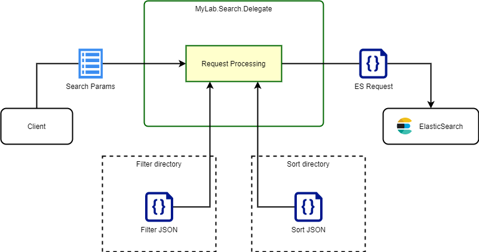
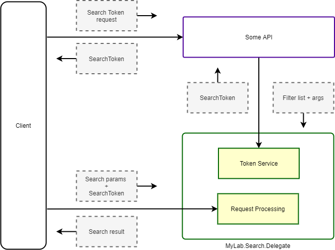

# MyLab.Search.Delegate

`Docker` образ: [](https://github.com/mylab-search-fx/Delegate/pkgs/container/Delegate)

Спецификация `API`: [](https://app.swaggerhub.com/apis/ozzy/mylab-search-delegate-api/1)

## Обзор

`MyLab.Search.Delegate` (далее `Delegate`) - сервис поиска по предварительно сконфигурированным условиям. 



Обобщённый и упрощённый алгоритм работы поиска с применением `Delegate` выглядит следующим образом:

* клиент делает запрос, используя высокоуровневые термины для описания требований к поиску: свободный текстовый запрос, литеральный идентификатор фильтра, сортировки, параметры пейджинга и т.д.;
* `Delegate` по литеральным идентификаторам находит предустановленные json-файлы с фильтрами и сортировками;
* из полученных данных строится запрос в `ElasticSearch`;
* с небольшими модификациями, результат передаётся клиенту.

`Delegate` позволяет осуществлять поиск по разным сущностям. Разделение достигается за счёт абстракции `пространств имён`. `namespace` указывается в адресе при поиске. Для каждого пространства имён могут быть свои настройки и ресурсы (фильтры и сортировки).  

## Токен поиска

### Применение токена поиска

Возможно применение `Delegate` в открытом виде, когда конечная точка для поиска доступна публично для доступа клиента напрямую без авторизации. В этом случае следует использовать токен поиска. 

Токен поиска предназначен для того, чтобы ограничить объём данных результатов поиска для клиента. Токен содержит информацию о том, к каким `namespace` пользователь имеет доступ и какие фильтры с какими аргументами при этом необходимо обязательно.

Например, отфильтровать для пользователя только его заявки, чтобы поиск происходил только по ним. Для этого при запросе токена поиска, необходимо будет указать идентификатор фильтра поиска заявок и указать идентификатор пользователя, как аргумент (при этом фильтр поиска самописный для конкретного случая и должен содержать аргумент, подразумевающий указание идентификатора пользователя).



Работа с токеном поиска выглядит следующим образом:

* авторизованный клиент запрашивает токен поиска у сервера;
* сервер определяет пользователя и принимает решение об ограничении области данных при поиске. Для этого формируется запрос токена поиска со списком применяемых фильтров и аргументов для них;
* сервер запрашивает токен поиска с указанными параметрами у `Delegate` по приватному каналу;
* `Dategate` формирует и возвращает токен поиска серверу;  
* сервер выдаёт токен поиска клиенту;
* клиент обращается к `Delegate` по публичному каналу, передавая интересующие параметры поиска и токен поиска;
* `Delegate` осуществляет поиск с применением, в том числе, указанных в токене фильтров, модифицированных соответствующими аргументами.

Особенности при работе с токеном поиска:

* при создании токена:
  * следует указать все `namespace`, к которым пользователь должен иметь доступ;
  * не проверяется наличие указанных фильтров и аргументов в этих фильтрах;
  * дата+время экспирации добавляется только если в конфигурации указано время жизни токена поиска; 
  * будет ошибка `423 (Locked)`, если `Delegate` не был сконфигурирован для работы с токенами;
* при поиске с токеном:
  * будет ошибка `400 (BadRequest)`, если `Delegate` не был сконфигурирован для работы с токенами;
  * будет ошибка `400 (BadRequest)`, если токен не указан или не прошёл проверку;
  * будет осуществлена проверка актуальности токена только если в конфигурации указано время жизни выдаваемого токена (т.е. если токен создаётся без указания даты+времени экспирации, то она и не проверяется);
  * токен передаётся в заголовке `X-Search-Token`.

### Запрос токена доступа

Запрос токена доступа перечисляет пространства имён, к которым должен иметь доступ клиент и ограничения по выборкам для этих пространств имён.

Структура запроса:

* `namespaces` - именованные узлы, содержащие настройки для каждого пространства имён, где имя узла - имя пространства имён:
  * `[namespace]`
    * `filters` - именованные узлы, которые представляют собой настройки фильтров, где имя узла - литеральный идентификатор фильтра;
      * `[filter-id]`
        * `[any]` - именованные параметры - аргументы для фильтра.

Пример запроса:

```json
{
  "namespaces": {
    "orders": {
      "filters": {
        "id-filter": {
          "from": "6",
          "to": "8"
        }
      }
    },
    "users": {
      "filters": {
        "my-region": {
          "region": "1022"
        },
        "enabled-only": {}
      }
    }
  }
}
```

В этом примере:

* `namespces` - настройки пространств имён;
  * `orders` - настройки пространства имён `orders`:
    * `filters` - настройки фильтров:
      * `id-filter` - настройки фильтра с идентификатором `id-filter`:
        * `from` - значение аргумента`from`;
        * `to` - значение аргумента`to`;
  * `users` - настройки пространства имён `users`:
    * `filters` - настройки фильтров:
      * `my-region` - настройки фильтра с идентификатором `my-region`:
        * `region` - значение аргумента`region`;
      * `enabled-only` - настройки фильтра с идентификатором `enabled-only` (без аргументов).

### Токен доступа

Токен поиска - это [JWT](https://jwt.io/) токен, содержащий следующие поля:

* `exp` -  дата+время экспирации (опционально);
* `mylab:search-dlgt:filters` - список фильтров и аргументов к ним.

Пример содержательной части токена в `json`:

```json
{
  "exp": 1628711837,
  "aud": [
    "users",
    "orders"
  ],
  "mylab:search-dlgt:namespaces": {
    "users": {
      "filters": {}
    },
    "orders": {
      "filters": {
          "only_my_orders": {
              "user": "user@domain.com"
          }
      }
    }
  }
}
```

В этом примере:

* `aud` - список пространств имён, к которым разрешает доступ токен;
* `exp` - дата и время истечения срока действия токена в секундах от начала эпохи (1970-01-01);
* `mylab:search-dlgt:namespaces` - настройки сервиса `Delegate`:
  * `users` - настройки доступа к пространству имён `users`:
    * `filters` - список фильтров, которые необходимо дополнительно применять при поиске в пространстве имён `users` (нет фильтров, т.е. без дополнительных ограничений);
  * `orders` - настройки доступа к пространству имён `orders`:
    * `filters` - список фильтров, которые необходимо дополнительно применять при поиске в пространстве имён `orders`:
      * `only_my_orders` - литеральный идентификатор фильтра
        * `user` - аргумент фильтра (определяется в содержании фильтра)
          * `user@domain.com` - значение аргумента, которое будет добавлено в фильтр.

## Запрос поиска

### Запрос клиента

Запрос клиента осуществляется следующим запросом:

```http
GET /search/[namespace]?query=...&filter=...&sort=...$offset=...&limit=...

X-Search-Token: eyJhbGciOiJIUzI1NiIsInR5cCI6IkpXVCJ9.....sagf0qhKM7TAxtuYcSGygZe7pls5nsO8khWl6zHOnY4
```

, где

* `namespace` (обязательный параметр) - пространство имён. Характеризует целевую сущность для поиска . Например, `orders`;
* `filter` - литеральный идентификатор фильтра;
* `sort`- литеральный идентификатор сортировки;
* `offset` - сдвиг выборки;
* `limit` - ограничение размера выборки;
* `X-Search-Token` - токен поиска.

Все параметры из `query` части `url` - опциональны.

Результат поиска - список объектов, описывающих найденные сущности. 

```
[
  {
    "content": { ... },
    "score": 1.2
  },
  {
    "content": { ... },
    "score": 1.1
  }
]
```

, где:

* `content` - содержательная часть найденного объекта;
* `score` - оценка релевантности от `ElasticSearch`.

### Запрос на сервере 

#### Содержание запроса в ES

После получения запроса от клиента, `Delegate` формирует на его основе запрос в `ElasticSearch` (далее `ES`). Условный шаблон запроса выглядит на примере ниже:

```
{
  "from": 0,
  "size": 10,
  "query": {
    "bool": {
      "minimum_should_match": 1,
      "should": [ ... query from request ... ],
      "filter": [ ... filters from requests and token ... ]
    }
  },
  "sort": { ... sort from request ... }
  }
}
```

Запрос в `ES` формируется по следующему алгоритму:

* `offset` - если указан, берётся из запроса клиента;
* `size` - если указан, берётся из запроса клиента (`limit`) или лимит по умолчанию из конфигурации или `10`;
* `should` - список условий поиска, формируются на основе параметра `query` из запроса. Отсутствует при отсутствии параметра `query` в запросе клиента;
* `filter` - загружается из локального файла из места, в соответствии с конфигурацией. Идентификатор фильтра берётся из запроса, если указан, или из конфигурации, как фильтр по умолчанию. Если в запросе передан токен поиска, то применяются и фильтры, указанные в нём. Если ни один фильтр не удалось определить, то этот узел в запросе отсутствует;
* `sort` - загружается из локального файла из места, в соответствии с конфигурацией. Идентификатор сортировки берётся из запроса, если указан, или из конфигурации, как сортировка по умолчанию. Если ни одну сортировку не удалось определить, то этот узел в запросе отсутствует;
* `minimum_should_match` - указывается если есть `should`. Фиксированное значение -1.

#### Фильтры запроса в ES

##### Загрузка фильтра

Фильтры загружаются из файлов `json` с содержанием, соответствующим [узлам условий поиска `ES`](https://www.elastic.co/guide/en/elasticsearch/reference/current/query-dsl.html) 

Путь к файлу фильтра формируется следующим образом:

```
[filter-dir]/[namespce]/[filter].json
```

, где:

* `filter-dir` - полный путь к директории. где находятся файлы с  фильтрами;
* `namespace` - пространство имён из запроса;
* `filter` - литеральный идентификатор фильтра.

Если не удалось найти файл в этой директории, то будет попытка обнаружить его в общей директории для всех пространств имён:

```
[filter-dir]/[filter].json
```

Если файл не будет найден и по этому адресу, то клиент получит ошибку `400 (BadRequest)`.

Пример файла фильтра:

```json
{
  "range": {
    "Id": {
      "gte": 2,
      "lt": 5
    }
  }
}
```

В этом примере, фильтр выбирает записи где поле `Id` имеет значение, удовлетворяющее условиям  `>=2` и `<5`;

##### Инициализация фильтра

Поддерживается только для фильтров, указанных в токене поиска.

После загрузки, фильтр инициализируется аргументами. Аргументы - список именованных значений.

Инициализация фильтра заключается в том, что в `json` фильтра заменяются тэги с именами аргументов на их значения.

Пример фильтра:

```
{
  "range": {
    "Id": {
      "gte": {from},
      "lt": {to}
    }
  }
}
```

В этом фильтре обозначены два аргумента: `from` и `to`.

##### Применяемые фильтры

Следующие фильтры применяются для формирования запроса в `ES`:

* фильтр, указанный в запросе клиента;
* если в запросе не указан фильтр, то используется фильтр по умолчанию, указанный в конфигурации текущего пространства имён;
* фильтры, указанные в токене поиска для текущего пространства имён.

#### Сортировка запроса в ES

##### Загрузка сортировки

Сортировки загружаются из файлов `json` с содержанием, соответствующим структуре [узла сортировки в запросе `ES`](https://www.elastic.co/guide/en/elasticsearch/reference/current/sort-search-results.html)

Путь к файлу фильтра формируется следующим образом:

```
[sort-dir]/[namespce]/[sort].json
```

, где:

* `sort-dir` - полный путь к директории. где находятся файлы с сортировками;
* `namespace` - пространство имён из запроса;
* `sort` - литеральный идентификатор фильтра.

Если не удалось найти файл в этой директории, то будет попытка обнаружить его в общей директории для всех пространств имён:

```
[sort-dir]/[sort].json
```

Если файл не будет найден и по этому адресу, то клиент получит ошибку `400 (BadRequest)`.

Пример файла сортировки:

```json
{
  "Id": {
     "order": "desc"
  }
}
```

В этом примере сортировка описывает очерёдность по полю `Id` в обратном порядке.

##### Инициализация фильтра

Поддерживается только для фильтров, указанных в токене поиска.

После загрузки, фильтр инициализируется аргументами. Аргументы - список именованных значений.

Инициализация фильтра заключается в том, что в `json` фильтра заменяются тэги с именами аргументов на их значения.

Пример фильтра:

```json
{
  "range": {
    "Id": {
      "gte": {from},
      "lt": {to}
    }
  }
}
```

, в этом фильтре обозначены два аргумента: `from` и `to`.

##### Применяемые сортировки

Следующие сортировки применяются для формирования запроса в `ES`:

* сортировка, указанная в запросе клиента;
* если в запросе не указана сортировка, то используется сортировка по умолчанию, указанная в конфигурации текущего пространства имён.

## Конфигурация

Основная конфигурация состоит из следующих узлов:

* `Elasticsearch` - настройки подключения к `ElasticSearch`:
  * `Url` - `url` подключения
* `Delegate` - настройки логики сервиса:
  * `SortPath` - путь по умолчанию к директории для хранения сортировок. Значение по умолчанию - `/etc/mylab-search-delegate/sort/`;
  * `FilterPath` - путь по умолчанию к директории для хранения фильтров. Значение по умолчанию - `/etc/mylab-search-delegate/filter/`;
  * `Token` - настройки использования токенов:
    * `ExpirySec` - (опционально) время жизни токена в секундах;
    * `SignKey` - текстовый ключ подписи токена. Должен быть не меньше 16 байт.
  * `Namespaces[]` - настройки пространств имён:
    * `Name` - наименование пространства имён; 
    * `Index` - целевой индекс в `ES`;
    * `DefaultFilter` - (опционально) литеральный идентификатор фильтра по умолчанию;
    * `DefaultSort`  - (опционально) литеральный идентификатор сортировки по умолчанию;
    * `DefaultLimit`- (опционально) лимиты выборки по умолчанию.

Отсутствие узла `Delegate/Token` означает отключение функции использования токенов. Это приведёт к ошибкам при попытке запросить токен или осуществить поиск с запросом, снабжённым токеном.

Отсутствие узла `Delegate/Token/ExpirySec` приведёт к тому, что:

* в токен не будет добавляться поле с датой и временем экспирации `exp`;
* при проверке токена не будет проверяться время его жизни.
