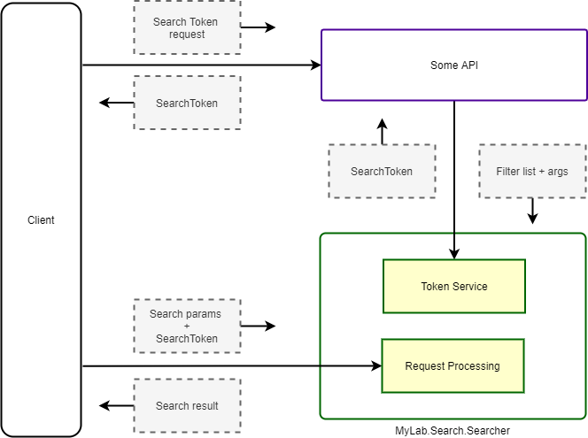

# MyLab.Search.Searcher

`Docker` образ сервиса:[](https://github.com/mylab-search-fx/Searcher/pkgs/container/Searcher)

Спецификация `API`: [-green)](https://app.swaggerhub.com/apis/ozzy/mylab-search-searcher/4) [-lightgray)](https://app.swaggerhub.com/apis/ozzy/mylab-search-searcher/3) 

Клиент на `.NETCore 3.1`: [](https://www.nuget.org/packages/MyLab.Search.Searcher.Client/)

Лицензия:  [](./LICENSE)

## Обзор

### Как это работает?

`MyLab.Search.Searcher` (далее `Searcher`) - сервис поиска по предварительно сконфигурированным условиям. 


Обобщённый и упрощённый алгоритм работы поиска с применением `Searcher` выглядит следующим образом:

* клиент делает запрос, используя высокоуровневые термины для описания требований к поиску: свободный текстовый запрос, литеральный идентификатор фильтра, сортировки, параметры пейджинга и т.д.;
* `Searcher` по литеральным идентификаторам находит предустановленные json-файлы с фильтрами и сортировками;
* из полученных данных строится запрос в `Elasticsearch`;
* с небольшими модификациями, результат передаётся клиенту.

`Searcher` позволяет осуществлять поиск по разным сущностям. Разделение достигается за счёт абстракции `индекс`. `Index` указывается в адресе при поиске. Для каждого индекса могут быть свои настройки и ресурсы (фильтры и сортировки).  

### Строка поиска

Для поиска `Searcher` получает в том числе и строку поиска. Эта строка может содержать несколько текстовых конструкций, используя которые `Searcher` дополняет запрос в `Elasticsearch` необходимыми условиями. 

Особенности:

* чем ближе слово к началу строки поиска, тем больший приоритет у найденных по нему записей;
* поддерживаются числовые условия:
  * `123` - значение любого из числовых полей эквивалентно значению `123`;
  * `<123` - значение любого из числовых полей меньше `123`;
  * `>123` - значение любого из числовых полей больше `123`;
  * `123-321` - значение любого из числовых полей больше или равно `123` и меньше или равно `321`;
* поддерживаются условия по дате:
  * как дата определяется литерал в формате:
    * `MM/dd/yyyy`
    * `dd.MM.yyyy`
    * `ddMMyy`, где `yy` - двузначный год текущего столетия
  * `01.02.2003` - значение любого из полей даты и времени в диапазоне больше или равно `01.02.2003 00:00:00` и меньше `02.02.2003 00:00:00`
  * `<01.02.2003` - значение любого из полей даты и времени меньше `01.02.2003 00:00:00` 
  * `>01.02.2003` - значение любого из полей даты и времени больше `01.02.2003 00:00:00`
  * `01.02.2003-03.02.2003` - значение любого из полей даты и времени в диапазоне больше или равно `01.02.2003 00:00:00` и меньше `03.02.2003 00:00:00`

## Токен поиска

### Применение токена поиска

Возможно применение `Searcher` в открытом виде, когда конечная точка для поиска доступна публично для доступа клиента напрямую без авторизации. В этом случае следует использовать токен поиска. 

Токен поиска предназначен для того, чтобы ограничить объём данных результатов поиска для клиента. Токен содержит информацию о том, к каким `index` пользователь имеет доступ и какие фильтры с какими аргументами при этом необходимо обязательно.

Например, отфильтровать для пользователя только его заявки, чтобы поиск происходил только по ним. Для этого при запросе токена поиска, необходимо будет указать идентификатор фильтра поиска заявок и указать идентификатор пользователя, как аргумент (при этом фильтр поиска самописный для конкретного случая и должен содержать аргумент, подразумевающий указание идентификатора пользователя).



Работа с токеном поиска выглядит следующим образом:

* авторизованный клиент запрашивает токен поиска у сервера;
* сервер определяет пользователя и принимает решение об ограничении области данных при поиске. Для этого формируется запрос токена поиска со списком применяемых фильтров и аргументов для них;
* сервер запрашивает токен поиска с указанными параметрами у `Searcher` по приватному каналу;
* `Searcher` формирует и возвращает токен поиска серверу;  
* сервер выдаёт токен поиска клиенту;
* клиент обращается к `Searcher` по публичному каналу, передавая интересующие параметры поиска и токен поиска;
* `Searcher` осуществляет поиск с применением, в том числе, указанных в токене фильтров, модифицированных соответствующими аргументами.

Особенности при работе с токеном поиска:

* при создании токена:
  * следует указать все `index`, к которым пользователь должен иметь доступ;
  * не проверяется наличие указанных фильтров и аргументов в этих фильтрах;
  * дата+время экспирации добавляется только если в конфигурации указано время жизни токена поиска; 
  * будет ошибка `423 (Locked)`, если `Searcher` не был сконфигурирован для работы с токенами;
* при поиске с токеном:
  * будет ошибка `400 (BadRequest)`, если `Searcher` не был сконфигурирован для работы с токенами;
  * будет ошибка `400 (BadRequest)`, если токен не указан или не прошёл проверку;
  * будет осуществлена проверка актуальности токена только если в конфигурации указано время жизни выдаваемого токена (т.е. если токен создаётся без указания даты+времени экспирации, то она и не проверяется);
  * токен передаётся в заголовке `X-Search-Token`.

### Запрос токена доступа

Запрос токена доступа перечисляет индексы, к которым должен иметь доступ клиент и ограничения по выборкам для этих индексов.

Структура запроса:

* `indexes`[] - именованные узлы, содержащие настройки для каждого индекса:
  * `id` - литеральный иеднтификатор индекса;
  * `filters` - именованные узлы, которые представляют собой настройки фильтров, где имя узла - литеральный идентификатор фильтра;
    * `id` - идентификатор фильтра;
    * `args` - аргументы фильтра:
      * `[any]` - именованные параметры - аргументы для фильтра.


Пример запроса:

```json
{
  "indexes": [
    {
      "id": "orders",
      "filters": [
        {
          "id": "id-filter",
          "args": {
            "from": "6",
            "to": "8"
          }
        }
      ]
    },
    {
      "id": "users",
      "filters": [
        {
          "id": "my-region",
          "args": {
            "region": "1022"
          }
        },
        {
          "id": "enabled-only"
        }
      ]
    }
  ]
}
```

В этом примере:

* `indexes` - настройки индексов;
  * `[0]` - настройки индекса `orders`
    * `id` - идентификатор индекса
    * `filters` - настройки фильтров:
      * `[0]` - настройки фильтра с идентификатором `id-filter`:
        * `id` - идентификатор фильтра;
        * `args` - аргументы фильтра:
          * `from` - значение аргумента`from`;
          * `to` - значение аргумента`to`;
  * `[1]` - настройки индекса `users`:
    * `id` - идентификатор индекса
    * `filters` - настройки фильтров:
      * `[0]` - настройки фильтра с идентификатором `my-region`:
        * `id` - идентификатор фильтра  `my-region`:
        * `args` - аргументы фильтра:
          * `region` - значение аргумента `region`;
      * `[1]` настройки фильтра с идентификатором `enabled-only`:
        * `id` - идентификатор фильтра `enabled-only`.

### Токен доступа

Токен поиска - это [JWT](https://jwt.io/) токен, содержащий следующие поля:

* `exp` -  дата+время экспирации (опционально);
* `aud` - индексы, к которым имеет доступ клиент;
* `mylab:searcher:indexes` - список настроек доступа к индексам.

Пример содержательной части токена в `json`:

```json
{
  "exp": 1628711837,
  "aud": [
    "users",
    "orders"
  ],
  "mylab:searcher:indexes": [
    {
      "id": "users"
    },
    {
      "id": "orders",
      "filters": [
        {
          "id": "only_my_orders",
          "args": {
            "user": "user@domain.com"
          }
        }
      ]
    }
  ]
}
```

В этом примере:

* `aud` - список индексов, к которым разрешает доступ токен;
* `exp` - дата и время истечения срока действия токена в секундах от начала эпохи (1970-01-01);
* `mylab:searcher:indexes` - настройки сервиса `Searcher`:
  * `[0]` - настройки доступа к индексу `users` (нет фильтров, т.е. без дополнительных ограничений):
    * `id` - идентификатор индекса `users`;
  * `[1]` - настройки доступа к индексу `orders`:
    * `id` - идентификатор индекса `orders`;
    * `filters` - список фильтров, которые необходимо дополнительно применять при поиске в индексе `orders`:
      * `[0]`:
        * `id` - литеральный идентификатор фильтра `only_my_orders`
        * `args` - аргументы фильтра:
          * `user` - значение аргумента `user`, которое будет добавлено в фильтр.

## Запрос поиска

### Запрос клиента

Запрос клиента осуществляется следующим запросом:

```http
POST /v4/indezes/[indexId]/searcher

X-Search-Token: eyJhbGciOiJIUzI1NiIsInR5cCI6IkpXVCJ9.....sagf0qhKM7TAxtuYcSGygZe7pls5nsO8khWl6zHOnY4

{
  "query": "something I want to search",
  "sort": {
  	"id": "early_first"
  },
  "offset": 0,
  "limit": 10,
  "queryMode": "should",
  "filters": [
    {
      "id": "only_my",
      "args": {
        "user": "user@host.ru",
        "less_then": 10
      }
    },
    {
      "id": "filter_without_args"
    }
  ]
}
```

, где

* `indexId` (обязательный параметр) - идентификатор индекса. Характеризует целевую сущность для поиска . Например, `orders`;
* `filters[]` - список фильтров:
  * `id` - идентификатор фильтра;
  * `args` - аргументы фильтра в виде ключ-значение

* `sort`- описание сотрировки:
  * `id` - идентификатор сотрировки;
  * `args` - аргументы сортировки в виде ключ-значение
* `offset` - сдвиг выборки;
* `limit` - ограничение размера выборки;
* `query-mode` - `should`/`must` стратегия поиска по строке поиска; 
* `X-Search-Token` - токен поиска.

Все параметры из `query` части `url` - опциональны.

Результат поиска - список объектов, описывающих найденные сущности. 

```json
[
  {
    "content": { ... },
    "score": 1.2
  },
  {
    "content": { ... },
    "score": 1.1
  }
]
```

, где:

* `content` - содержательная часть найденного объекта;
* `score` - оценка релевантности от `Elasticsearch`.

### Запрос на сервере 

#### Содержание запроса для ES

После получения запроса от клиента, `Searcher` формирует на его основе запрос в `Elasticsearch`.  Условный шаблон запроса выглядит на примере ниже:

```json
{
  "from": 0,
  "size": 10,
  "query": {
    "bool": {
      "minimum_should_match": 1,
      "should": [ ... query from request ... ],
      "must": [ ... query from request ... ],
      "filter": [ ... filters from requests and token ... ]
    }
  },
  "sort": { ... sort from request ... }
  }
}
```

Запрос в `ES` формируется по следующему алгоритму:

* `offset` - если указан, берётся из запроса клиента;
* `size` - если указан, берётся из запроса клиента (`limit`) или лимит по умолчанию из конфигурации или `10`;
* `should` - список условий поиска, если выбрана стратегия поиска `Should` формируются на основе параметра `query` из запроса;
* `must` - список условий поиска, если выбрана стратегия поиска `Must` формируются на основе параметра `query` из запроса;
* `filter` - загружается из локального файла из места, в соответствии с конфигурацией. Идентификатор фильтра берётся из запроса, если указан, или из конфигурации, как фильтр по умолчанию. Если в запросе передан токен поиска, то применяются и фильтры, указанные в нём. Если ни один фильтр не удалось определить, то этот узел в запросе отсутствует;
* `sort` - загружается из локального файла из места, в соответствии с конфигурацией. Идентификатор сортировки берётся из запроса, если указан, или из конфигурации, как сортировка по умолчанию. Если ни одну сортировку не удалось определить, то этот узел в запросе отсутствует;
* `minimum_should_match` - указывается если есть `should`. Фиксированное значение -1.

#### Формирование запроса для ES

Запрос формируется следующим образом:

* определяются параметры пейджинга;
* определяется и загружается сортировка из запроса клиента или по умолчанию;
* определяются, загружаются и инициализируются аргументами фильтры из токена поиска;
* определяется и загружается фильтр из запроса клиента или по умолчанию;
* применяется строка поиска:
  * разбирается по условиям;
  * формируются выражения поиска из условий, применённых к полям мэппинга индекса;
  * выражения для каждого литерала строки поиска объединяются по условию [bool->should](https://www.elastic.co/guide/en/elasticsearch/reference/current/query-dsl-bool-query.html) с минимальным количеством совпадений - `1`;
  * консолидированные выражения литералов объединяются в соответствии с выбранной стратегией поиска по строке поиска:
    *   [bool->should](https://www.elastic.co/guide/en/elasticsearch/reference/current/query-dsl-bool-query.html) - если стратегия `Should` с минимальным количеством совпадений - `1`;
    *   [bool->must](https://www.elastic.co/guide/en/elasticsearch/reference/current/query-dsl-bool-query.html) - если стратегия `Must`;

#### Фильтры запроса для ES

##### Загрузка фильтра

Фильтры загружаются из файлов `json` с содержанием, соответствующим [узлам условий поиска `ES`](https://www.elastic.co/guide/en/elasticsearch/reference/current/query-dsl.html) 

Путь к файлу фильтра формируется следующим образом:

```
[filter-dir]/[index]/[filter].json
```

, где:

* `filter-dir` - полный путь к директории. где находятся файлы с  фильтрами;
* `index` - идентификатор индекса из запроса;
* `filter` - литеральный идентификатор фильтра.

Если не удалось найти файл в этой директории, то будет попытка обнаружить его в общей директории для всех индексов:

```
[filter-dir]/[filter].json
```

Если файл не будет найден и по этому адресу, то клиент получит ошибку `400 (BadRequest)`.

Пример файла фильтра:

```json
{
  "range": {
    "Id": {
      "gte": 2,
      "lt": 5
    }
  }
}
```

В этом примере, фильтр выбирает записи где поле `Id` имеет значение, удовлетворяющее условиям  `>=2` и `<5`;

##### Инициализация фильтра

После загрузки, фильтр инициализируется аргументами. Аргументы - список именованных значений.

Инициализация фильтра заключается в том, что в `json` фильтра заменяются тэги с именами аргументов на их значения.

Пример фильтра:

```json
{
  "range": {
    "Id": {
      "gte": {from},
      "lt": {to}
    }
  }
}
```

В этом фильтре обозначены два аргумента: `from` и `to`.

##### Применяемые фильтры

Следующие фильтры применяются для формирования запроса в `Elasticsearch`:

* фильтр, указанный в запросе клиента;
* если в запросе не указан фильтр, то используется фильтр по умолчанию, указанный в конфигурации текущего индекса;
* фильтры, указанные в токене поиска для текущего индекса.

#### Сортировка запроса для ES

##### Загрузка сортировки

Сортировки загружаются из файлов `json` с содержанием, соответствующим структуре [узла сортировки в запросе `ES`](https://www.elastic.co/guide/en/elasticsearch/reference/current/sort-search-results.html)

Путь к файлу фильтра формируется следующим образом:

```
[sort-dir]/[index]/[sort].json
```

, где:

* `sort-dir` - полный путь к директории. где находятся файлы с сортировками;
* `index` - идентификатор индекса из запроса;
* `sort` - литеральный идентификатор фильтра.

Если не удалось найти файл в этой директории, то будет попытка обнаружить его в общей директории для всех индесов:

```
[sort-dir]/[sort].json
```

Если файл не будет найден и по этому адресу, то клиент получит ошибку `400 (BadRequest)`.

Пример файла сортировки:

```json
{
  "Id": {
     "order": "desc"
  }
}
```

В этом примере сортировка описывает очерёдность по полю `Id` в обратном порядке.

##### Инициализация сортировки

После загрузки, сортировка инициализируется аргументами. Аргументы - список именованных значений.

Инициализация сортировки заключается в том, что в `json` сотрировки заменяются тэги с именами аргументов на их значения.

Пример фильтра:

```json
{
  "Id": {
     "order": "{direction}"
  }
}
```

В этом фильтре обозначен аргумент `direction`, который можно указать как `asc`, так и `desc`.

##### Порядок сортировок

Следующие сортировки применяются для формирования запроса в `Elasticsearch`:

* если не указана сортировка в запросе пользователя:
  * сортировка по релевантности, если осуществляется поиск по строке поиска, переданный в запросе клиента;
  * сортировка по умолчанию, если указана;
* в противном случае - сортировка из запроса пользователя.

### Разбор строки поиска

#### Общий алгоритм разбора строки поиска

Ниже приведён алгоритм формирования условий поиска в `Elasticsearch` на основании строки поиска, переданной клиентом:

* текст разбивается на литералы по пробелам и табуляциям;

* по каждому литералу:

  * назначается вес литерала в соответствии с его порядком в строке поиска. Это значит, что найденная запись по условию с этим литералом будет иметь значение релевантности, равное весу этого литерала. Вес вычисляется как количество литералов в строке поиска минус порядковый номер литерала, начинающийся с `0`:

    ```
    boost = literal_count - 0_index;
    ```

    Это означает, что совпадения по литералам ближе к началу строки поиска будут иметь большую релевантность, чем по литералом ближе к концу строки поиска;

  * определяется, как условие по регулярному выражению [regexp](https://www.elastic.co/guide/en/elasticsearch/reference/current/query-dsl-regexp-query.html) для полей типа [keyword](https://www.elastic.co/guide/en/elasticsearch/reference/current/keyword.html#keyword-field-type). Регулярное выражение формируется по правилу:

    ```
    norm_literal.*
    ```
  
    , где `norm_literal` - нормализованная строка, где [служебные символы](https://www.elastic.co/guide/en/elasticsearch/reference/current/regexp-syntax.html#regexp-reserved-characters) экранированы;
  
  * определяется, как условие по регулярному выражению [regexp](https://www.elastic.co/guide/en/elasticsearch/reference/current/query-dsl-regexp-query.html) для полей типа  [text](https://www.elastic.co/guide/en/elasticsearch/reference/current/text.html#text-field-type). Регулярное выражение формируется по правилу:
  
    ```
    norm_literal.*
    ```
  
    , где `norm_literal` - нормализованная строка, переведённая в нижний регистр, где [служебные символы](https://www.elastic.co/guide/en/elasticsearch/reference/current/regexp-syntax.html#regexp-reserved-characters) экранированы;
  
  * определяется как выражение для полнотекстового поиска [match](https://www.elastic.co/guide/en/elasticsearch/reference/current/query-dsl-match-query.html) по полям типа [text](https://www.elastic.co/guide/en/elasticsearch/reference/current/text.html#text-field-type);
  
  * попытка определить числовое условие. Применяется с применением условия [range](https://www.elastic.co/guide/en/elasticsearch/reference/current/query-dsl-range-query.html);
  
  * попытка определить условие по датам. Применяется с применением условия [range](https://www.elastic.co/guide/en/elasticsearch/reference/current/query-dsl-range-query.html);

#### Определение числового диапазона

* число, если успешно определяется методом [int.TryParse()](https://docs.microsoft.com/ru-ru/dotnet/api/system.int32.tryparse?view=net-5.0);

  ```
  123
  ```

* диапазон чисел с включением границ, если есть дефис, разделяющий наборы символов, успешно определяемые как  целочисленное значение методом  [int.TryParse()](https://docs.microsoft.com/ru-ru/dotnet/api/system.int32.tryparse?view=net-5.0);

  ```
  123-321
  ```

* диапазон чисел до указанного числа, исключая его - если начинается с символа `<` и остальной набор символов определяется как целочисленное значение методом  [int.TryParse()](https://docs.microsoft.com/ru-ru/dotnet/api/system.int32.tryparse?view=net-5.0);

  ```
  <321
  ```

* диапазон чисел от указанного числа, исключая его - если начинается с символа `>` и остальной набор символов определяется как целочисленное значение методом  [int.TryParse()](https://docs.microsoft.com/ru-ru/dotnet/api/system.int32.tryparse?view=net-5.0);

  ```
  >321
  ```

#### Определение диапазона даты времени

* диапазон даты и времени от начала до окончания суток указанной даты, если литерал соответствует:

  * [короткому](https://docs.microsoft.com/ru-ru/dotnet/standard/base-types/standard-date-and-time-format-strings#ShortDate) формату даты для `CultureInfo.InvariantCulture`. Пример ниже соответствует диапазону больше или равно`10.04.2008 00:00` и меньше `11.04.2008 00:00` :

    ```
    04/10/2008
    ```

  * формату даты `dd.MM.yyyy`. Пример ниже соответствует диапазону больше или равно `10.04.2008 00:00` и меньше `11.04.2008 00:00` :

    ```
    10.04.2008
    ```

  * формату даты `ddMMyy`, где `yy` - двухзначный год текущего столетия. Пример ниже соответствует диапазону больше или равно `10.04.2008 00:00` и меньше `11.04.2008 00:00` :

    ```
    100408
    ```

* диапазон даты и времени от начала суток указанной даты начала диапазона до начала суток указанной даты окончания диапазона, если литерал содержит дефис, который разделяет последовательности символов, соответствующих:

  * [короткому](https://docs.microsoft.com/ru-ru/dotnet/standard/base-types/standard-date-and-time-format-strings#ShortDate) формату даты для `CultureInfo.InvariantCulture`. Пример ниже соответствует диапазону больше или равно `10.04.2008 00:00` и меньше `12.04.2008 00:00` :

    ```
    04/10/2008-04/12/2008
    ```

  * формату даты `dd.MM.yyyy`. Пример ниже соответствует диапазону больше или равно `10.04.2008 00:00` и меньше `12.04.2008 00:00` :

    ```
    10.04.2008-12.04.2008
    ```

  * формату даты `ddMMyy`, где `yy` - двухзначный год текущего столетия. Пример ниже соответствует диапазону больше или равно  `10.04.2008 00:00` и меньше `12.04.2008 00:00` :

    ```
    100408-120408
    ```

* диапазон даты и времени до начала суток указанной даты, если литерал начинается с символа `<` и содержит последовательность символов, соответствующих:

  * [короткому](https://docs.microsoft.com/ru-ru/dotnet/standard/base-types/standard-date-and-time-format-strings#ShortDate) формату даты для `CultureInfo.InvariantCulture`. Пример ниже соответствует диапазону меньше  `12.04.2008 00:00` :

    ```
    <04/12/2008
    ```

  * формату даты `dd.MM.yyyy`. Пример ниже соответствует диапазону меньше  `12.04.2008 00:00` :

    ```
    <12.04.2008
    ```

  * формату даты `ddMMyy`, где `yy` - двухзначный год текущего столетия. Пример ниже соответствует диапазону меньше `12.04.2008 00:00` :

    ```
    <120408
    ```

* диапазон даты и времени от начала суток указанной даты, если литерал начинается с символа `>` и содержит последовательность символов, соответствующих:

  * [короткому](https://docs.microsoft.com/ru-ru/dotnet/standard/base-types/standard-date-and-time-format-strings#ShortDate) формату даты для `CultureInfo.InvariantCulture`. Пример ниже соответствует диапазону больше или равно `10.04.2008 00:00`:

    ```
    >04/10/2008
    ```

  * формату даты `dd.MM.yyyy`. Пример ниже соответствует диапазону больше или равно `10.04.2008 00:00`:

    ```
    >12.04.2008
    ```

  * формату даты `ddMMyy`, где `yy` - двухзначный год текущего столетия. Пример ниже соответствует диапазону больше или равно `10.04.2008 00:00`:

    ```
    >120408
    ```

## Конфигурация

Основная конфигурация состоит из следующих узлов:

* `ES` - настройки подключения к `Elasticsearch`:
  * `Url` - `url` подключения
* `Searcher` - настройки логики сервиса:
  * `SortPath` - путь по умолчанию к директории для хранения сортировок. Значение по умолчанию - `/etc/mylab-search-searcher/sort/`;
  * `FilterPath` - путь по умолчанию к директории для хранения фильтров. Значение по умолчанию - `/etc/mylab-search-searcher/filter/`;
  * `QueryStrategy` - стратегия поиска по строке поиска `should`/`must`. Определяет общую стратегию для  всех индексов. Значение по умолчанию - `should`;
  * `EsIndexNamePrefix` - префикс, который будет добавляться к имени индекса `Elasticsearch` всех индесов поисковика;
  * `EsIndexNamePostfix` - постфикс, который будет добавляться к имени индекса `Elasticsearch` всех индексов поисковика;
  * `Token` - настройки использования токенов:
    * `ExpirySec` - (опционально) время жизни токена в секундах;
    * `SignKey` - текстовый ключ подписи токена. Должен быть не меньше 16 байт.
  * `Indexes[]` - настройки индексов:
    * `Id` - идентификатор индекса; 
    * `EsIndex` - целевой индекс в `Elasticsearch`;
    * `DefaultFilter` - (опционально) литеральный идентификатор фильтра по умолчанию;
    * `DefaultSort`  - (опционально) литеральный идентификатор сортировки по умолчанию;
    * `DefaultLimit`- (опционально) лимиты выборки по умолчанию;
    * `QueryStrategy` - стратегия поиска по строке поиска `should`/`must`. Если указано, переопределяет стратегию для индекса. Значение по умолчанию - `Undefined`;
  * `Debug` - флаг, определяющий добавление отладочной информации о поиске в `Elasticsearch` (см. [Отладка запросов поиска](#Отладка-запросов-поиска)) 

Отсутствие узла `Searcher/Token` означает отключение функции использования токенов. Это приведёт к ошибкам при попытке запросить токен или осуществить поиск с запросом, снабжённым токеном.

Отсутствие узла `Searcher/Token/ExpirySec` приведёт к тому, что:

* в токен не будет добавляться поле с датой и временем экспирации `exp`;
* при проверке токена не будет проверяться время его жизни.

## Отладка

### Отладка запросов поиска

Для включения отладки запросов поиска, необходимо в настройках указать `Searcher__Debug: true` (на примере конфигурирования через переменные окружения).  

При этом в ответ поиска будут включены:

* поле `esRequest` - объект запроса в `Elasticsearch`. Подробнее про [объект запроса поиска](https://www.elastic.co/guide/en/elasticsearch/reference/current/search-search.html#search-search-api-request-body).
* поле `explanation` - для каждой найденной сущности, объект описания причины включения сущности в результат поиска. Подробнее про объекты [Explanation](https://www.elastic.co/guide/en/elasticsearch/reference/current/search-explain.html#search-explain-api-example).

Ниже приведён пример ответа с данными отладки:

```json
{
  "entities": [
    {
      "content": {
        "Id": 1,
        "Value": "val_1",
        "Date": "0001-01-01T00:00:00"
      },
      "score": 1,
      "explanation": {
        "description": "*:*",
        "details": [],
        "value": 1
      }
    }
  ],
  "total": 20,
  "esRequest": {
    "trackScores": true,
    "from": 0,
    "size": 1
  }
}
```
